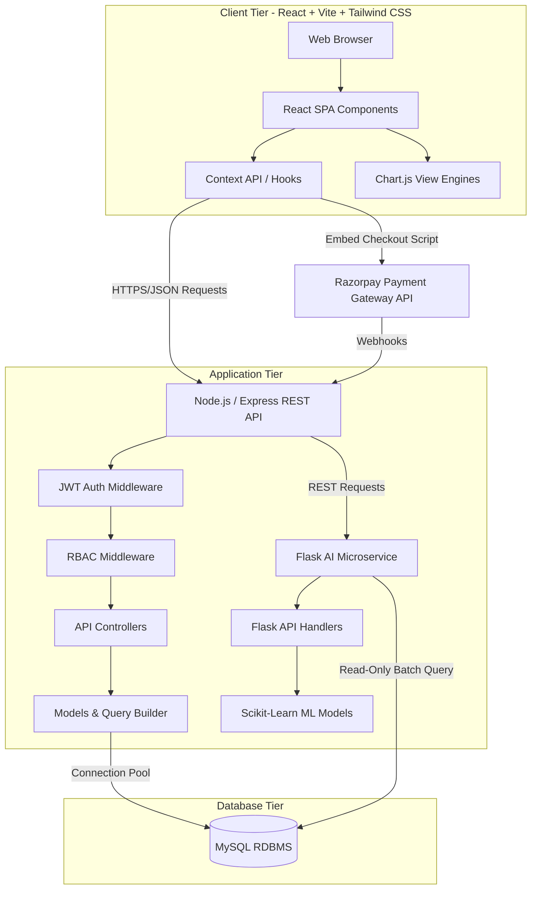
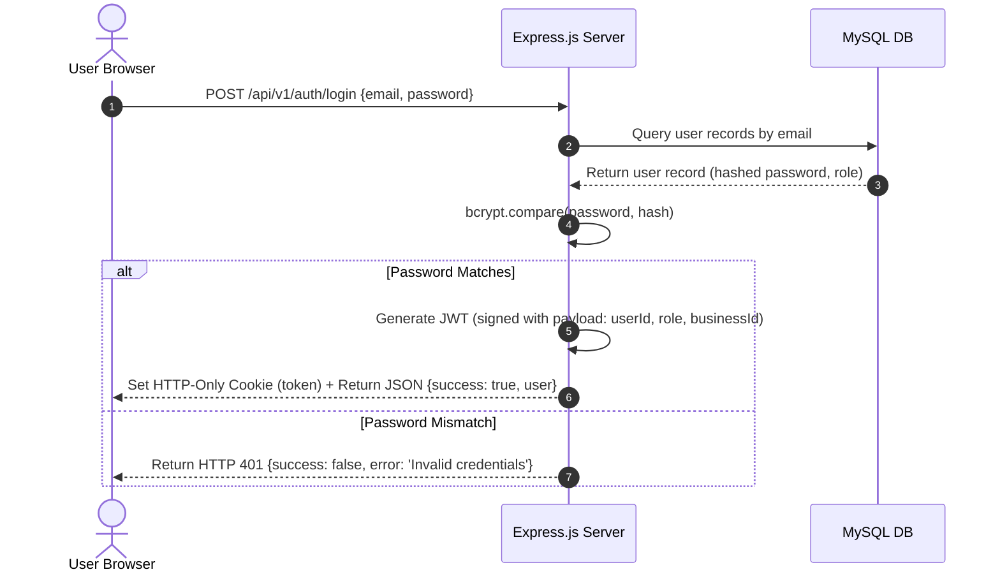
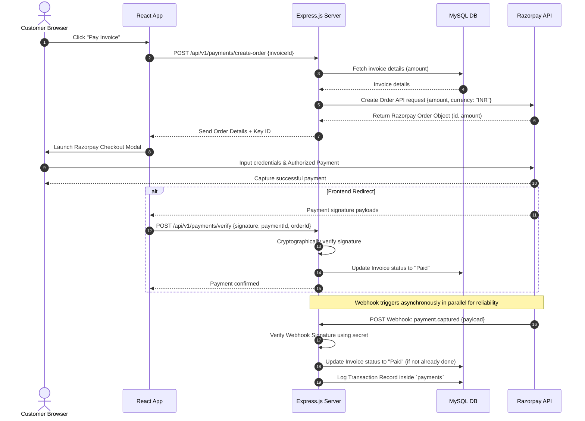
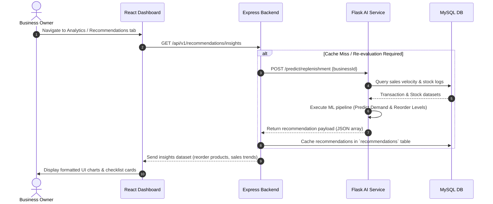

# NexBiz - Software Architecture Document

This document provides a comprehensive overview of the NexBiz architecture, mapping out the components, data flows, integration points, and overall system design.

---

## 1. System Architecture Overview

NexBiz is designed using a **decoupled three-tier client-server architecture** composed of a React Single Page Application (SPA), a stateless Express.js REST API server, and a specialized Python Flask microservice for machine learning capabilities, all backed by a normalized MySQL relational database.

---

## 2. Component Specifications

### 2.1 Frontend Architecture
- **Framework**: React.js structured as a Single Page Application (SPA) compiled using **Vite** for rapid hot-reloads and optimized tree-shaken builds.
- **Styling**: **Tailwind CSS** utilizing mobile-first grid and flexbox utility utility layers.
- **Routing**: `react-router-dom` handles client-side routing, protected routes based on auth state, and dynamic route loading.
- **State Management**: React Context API handles global states (user sessions, settings, theme controls) coupled with custom React Hooks (`useAuth`, `useFetch`) to coordinate backend API calls.
- **Data Visualizations**: Responsive charts generated dynamically via `chart.js` wrapping Canvas layouts.

### 2.2 Backend Architecture
- **Environment**: Node.js runtime hosting an Express.js web framework application.
- **Pattern**: Model-View-Controller (MVC) pattern (with the View handled in the frontend React tier).
  - **Routes**: Decouples URLs and matches endpoints to specific controller actions.
  - **Middleware**: Processes requests before route-handlers execute (e.g. rate-limiting, request sanitization, authentication, RBAC checks).
  - **Controllers**: Evaluates business logic, aggregates data, and returns standard JSON payloads.
  - **Models**: Defines database schemas, validation rules, and queries MySQL.
- **Database Connection**: `mysql2/promise` using connection pool configurations with limits (`connectionLimit: 10`, `queueLimit: 0`, `idleTimeout: 60000`).

### 2.3 AI Microservice Architecture
- **Environment**: Python Flask engine hosting machine learning inference APIs.
- **Toolkit**: Scikit-Learn for statistical calculations (regression for sales trend forecasting, classification/clustering for inventory item replenishment recommendations).
- **Integration**: The Node.js server communicates with the Flask microservice over internal HTTP REST APIs. The Flask server performs lightweight reads on the MySQL database when re-training models, or consumes payload data sent directly by Node.js.

---

## 3. Core System Data Flows

### 3.1 Authentication Flow (JWT + Cookies)
The platform uses signed JSON Web Tokens (JWT) stored in HTTP-Only, Secure cookies to prevent XSS-based token theft.

### 3.2 Invoice Payment Flow (Razorpay + Webhook)
Ensures payments are captured and verified asynchronously, making the transaction process secure and resilient to network dropouts.

### 3.3 AI Recommendation Flow
Generates operational recommendations asynchronously based on business historical activity.

