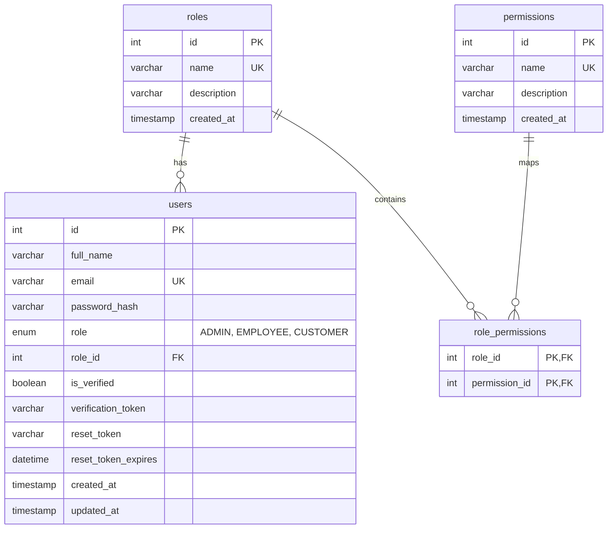

# System Architecture & Database Design - NexBiz

This document covers the high-level architecture, repository structure, database ER diagram, and testing payloads for the NexBiz platform.

---

## 1. Directory Structure Layout
The monorepo contains decoupled frontend and backend applications:

```text
NexBiz-Next-Generation-Business-Management-Platform/
├── client/                      # React SPA
│   ├── .env.example             # Client environment template
│   └── (Vite boilerplate)
├── server/                      # Node.js/Express REST API
│   ├── config/
│   │   ├── db.js                # mysql2/promise connection pool
│   │   └── schema.sql           # Database schema & seeds
│   ├── controllers/
│   │   └── authController.js    # Auth & Profile controllers
│   ├── middleware/
│   │   ├── auth.js              # JWT & RBAC middlewares
│   │   └── validator.js         # Input validation schemas
│   ├── routes/
│   │   └── auth.js              # Mounts /api/auth routes
│   ├── utils/
│   │   └── response.js          # Standardized response helper
│   ├── .env.example             # Server environment template
│   ├── package.json             # NPM dependencies
│   └── server.js                # Entry point
└── docs/                        # Specifications & documentation
    ├── srs.md                   # System Requirements Specification
    └── architecture.md          # Architecture & API details
```

---

## 2. Database Entity Relationship Diagram (ERD)



---

## 3. Core API Endpoints

| Method | Endpoint | Access | Description |
| :--- | :--- | :--- | :--- |
| `POST` | `/api/auth/register` | Public | Register a new user profile |
| `POST` | `/api/auth/login` | Public | Authenticate credentials and return signed JWT |
| `POST` | `/api/auth/forgot-password` | Public | Send recovery email with reset token |
| `POST` | `/api/auth/reset-password` | Public | Reset password using token |
| `GET` | `/api/auth/profile` | Private | Retrieve authenticated user profile |
| `PUT` | `/api/auth/profile` | Private | Update user profile details |

---

## 4. Postman / API Payloads & Responses

### 4.1 Register User
- **URL**: `POST /api/auth/register`
- **Body (JSON)**:
```json
{
  "full_name": "Jane Doe",
  "email": "jane@example.com",
  "password": "SecurePassword123",
  "role": "CUSTOMER"
}
```
- **Response (201 Created)**:
```json
{
  "success": true,
  "message": "User registered successfully. Please verify your email.",
  "data": {
    "email": "jane@example.com",
    "role": "CUSTOMER",
    "verificationToken": "35a8f5e71887e594..."
  }
}
```

### 4.2 Login User
- **URL**: `POST /api/auth/login`
- **Body (JSON)**:
```json
{
  "email": "jane@example.com",
  "password": "SecurePassword123"
}
```
- **Response (200 OK)**:
```json
{
  "success": true,
  "message": "User authenticated successfully",
  "data": {
    "token": "eyJhbGciOiJIUzI1NiIsInR5cCI6IkpXVCJ9...",
    "user": {
      "id": 1,
      "full_name": "Jane Doe",
      "email": "jane@example.com",
      "role": "CUSTOMER",
      "is_verified": false
    }
  }
}
```

### 4.3 Forgot Password
- **URL**: `POST /api/auth/forgot-password`
- **Body (JSON)**:
```json
{
  "email": "jane@example.com"
}
```
- **Response (200 OK)**:
```json
{
  "success": true,
  "message": "If that email address exists in our system, a password reset link has been sent.",
  "data": null
}
```

### 4.4 Reset Password
- **URL**: `POST /api/auth/reset-password`
- **Body (JSON)**:
```json
{
  "token": "35a8f5e71887e594...",
  "password": "NewSecurePassword456"
}
```
- **Response (200 OK)**:
```json
{
  "success": true,
  "message": "Your password has been successfully reset. You can now login.",
  "data": null
}
```

### 4.5 Get User Profile
- **URL**: `GET /api/auth/profile`
- **Headers**: `Authorization: Bearer <JWT_TOKEN>`
- **Response (200 OK)**:
```json
{
  "success": true,
  "message": "User profile retrieved successfully",
  "data": {
    "id": 1,
    "full_name": "Jane Doe",
    "email": "jane@example.com",
    "role": "CUSTOMER",
    "is_verified": false,
    "created_at": "2026-08-06T09:00:00.000Z",
    "updated_at": "2026-08-06T09:00:00.000Z"
  }
}
```

### 4.6 Update User Profile
- **URL**: `PUT /api/auth/profile`
- **Headers**: `Authorization: Bearer <JWT_TOKEN>`
- **Body (JSON)**:
```json
{
  "full_name": "Jane Doe Modified"
}
```
- **Response (200 OK)**:
```json
{
  "success": true,
  "message": "User profile updated successfully",
  "data": {
    "id": 1,
    "full_name": "Jane Doe Modified",
    "email": "jane@example.com",
    "role": "CUSTOMER",
    "is_verified": false,
    "created_at": "2026-08-06T09:00:00.000Z",
    "updated_at": "2026-08-06T09:10:00.000Z"
  }
}
```
