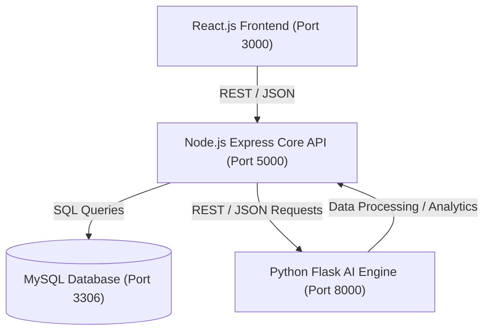

# System Architecture - NexBiz

This document outlines the decoupled system architecture of the NexBiz platform, highlighting service divisions, communication protocols, and data models.

---

## 1. High-Level Architectural Flow

---

## 2. Component Responsibility Breakdown

### 2.1 Frontend Client (SPA)
- **Role**: Presentation layer.
- **Tech Stack**: React.js, React Router, TailwindCSS (optional / custom styles), Axios.
- **Responsibility**:
  - Provides a single-page application experience.
  - Implements route guards for Role-Based Access Control (RBAC).
  - Handles API requests, client-side session management, and state storage.

### 2.2 Core Backend Server
- **Role**: Business logic controller & orchestrator.
- **Tech Stack**: Node.js, Express, `mysql2/promise` (connection pooling).
- **Responsibility**:
  - Validates API requests and enforces authentication (JWT) and RBAC policies.
  - Manages database CRUD operations.
  - Acts as an orchestrator, delegating heavy analytical tasks to the AI Analytics Service.

### 2.3 AI Analytics Engine (Microservice)
- **Role**: Data analysis and predictive modeling.
- **Tech Stack**: Python, Flask, Pandas, NumPy, Scikit-learn.
- **Responsibility**:
  - Executes predictive analytics (e.g., forecasting overdue invoices, predicting lead conversions).
  - Provides clean REST endpoints for JSON analysis payloads.

### 2.4 Database Layer
- **Role**: Persistence layer.
- **Tech Stack**: MySQL (InnoDB engine).
- **Responsibility**:
  - Maintains transactional consistency (ACID rules).
  - Enforces database triggers for timestamps and cascading deletes.
  - Handles optimization via custom indexes.
