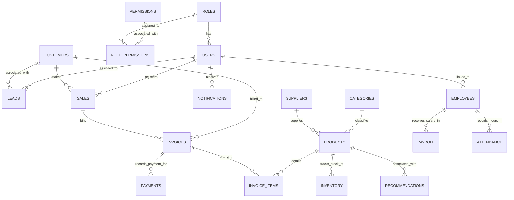

# NexBiz - Database Design Specification

This document details the database schema design for NexBiz, featuring 19 normalized relational tables designed to run on MySQL.

---

## 1. Entity-Relationship (ER) Diagram

The system uses a highly normalized structure supporting multi-tenancy through a `business_id` scoping key.

---

## 2. Table Schemas & Dictionary

Here are the details of the database fields, validation rules, keys, and indexes.

### 2.1 Access Control (Auth)
- **`roles`**: Defines permissions groups.
  - `id` INT (PK, AUTO_INCREMENT)
  - `name` VARCHAR(50) (UNIQUE, NOT NULL, e.g. 'super_admin', 'business_owner', 'manager', 'employee', 'customer')
  - `description` VARCHAR(255)
- **`permissions`**: Granular platform access tokens.
  - `id` INT (PK, AUTO_INCREMENT)
  - `name` VARCHAR(100) (UNIQUE, NOT NULL, e.g. 'crm:create', 'payroll:approve')
  - `description` VARCHAR(255)
- **`role_permissions`**: Junction table.
  - `role_id` INT (FK -> `roles.id`, ON DELETE CASCADE)
  - `permission_id` INT (FK -> `permissions.id`, ON DELETE CASCADE)
  - *Composite PK (`role_id`, `permission_id`)*
- **`users`**: Platform user credentials.
  - `id` INT (PK, AUTO_INCREMENT)
  - `business_id` INT (Indexed, NULL for Super Admin, identifies tenant for others)
  - `name` VARCHAR(100) (NOT NULL)
  - `email` VARCHAR(150) (UNIQUE, NOT NULL)
  - `password_hash` VARCHAR(255) (NOT NULL)
  - `role_id` INT (FK -> `roles.id`)
  - `created_at` TIMESTAMP

### 2.2 Customer & CRM
- **`customers`**: Business client records.
  - `id` INT (PK, AUTO_INCREMENT)
  - `business_id` INT (Indexed, NOT NULL)
  - `name` VARCHAR(100) (NOT NULL)
  - `email` VARCHAR(150)
  - `phone` VARCHAR(20)
  - `company_name` VARCHAR(100)
  - `address` TEXT
- **`leads`**: Sales pipeline opportunities.
  - `id` INT (PK, AUTO_INCREMENT)
  - `business_id` INT (Indexed, NOT NULL)
  - `customer_id` INT (FK -> `customers.id`, NULLABLE, joins on conversion)
  - `title` VARCHAR(150) (NOT NULL)
  - `description` TEXT
  - `source` VARCHAR(50) (e.g. 'Website', 'Referral')
  - `status` ENUM('New', 'Contacted', 'Qualified', 'Proposal', 'Won', 'Lost')
  - `value` DECIMAL(12,2)
  - `assigned_to` INT (FK -> `users.id`, NULLABLE)

### 2.3 Catalog & Stock
- **`categories`**: Product classifications.
  - `id` INT (PK, AUTO_INCREMENT)
  - `business_id` INT (Indexed, NOT NULL)
  - `name` VARCHAR(100) (NOT NULL)
  - `description` TEXT
- **`suppliers`**: Wholesale product vendors.
  - `id` INT (PK, AUTO_INCREMENT)
  - `business_id` INT (Indexed, NOT NULL)
  - `name` VARCHAR(100) (NOT NULL)
  - `contact_name` VARCHAR(100)
  - `email` VARCHAR(150)
  - `phone` VARCHAR(20)
  - `address` TEXT
- **`products`**: Sellable products catalog.
  - `id` INT (PK, AUTO_INCREMENT)
  - `business_id` INT (Indexed, NOT NULL)
  - `category_id` INT (FK -> `categories.id`, NULLABLE)
  - `supplier_id` INT (FK -> `suppliers.id`, NULLABLE)
  - `sku` VARCHAR(50) (NOT NULL, Unique per business_id)
  - `name` VARCHAR(150) (NOT NULL)
  - `description` TEXT
  - `price` DECIMAL(12,2) (NOT NULL)
  - `reorder_level` INT (DEFAULT 10)
- **`inventory`**: Real-time stock counts.
  - `id` INT (PK, AUTO_INCREMENT)
  - `business_id` INT (Indexed, NOT NULL)
  - `product_id` INT (FK -> `products.id`, UNIQUE per business/product)
  - `quantity` INT (NOT NULL, DEFAULT 0)
  - `last_restocked` TIMESTAMP

### 2.4 Transactions & Billings
- **`sales`**: Closed deals log.
  - `id` INT (PK, AUTO_INCREMENT)
  - `business_id` INT (Indexed, NOT NULL)
  - `customer_id` INT (FK -> `customers.id`)
  - `user_id` INT (FK -> `users.id`, sales agent)
  - `total_amount` DECIMAL(12,2) (NOT NULL)
  - `sale_date` TIMESTAMP
- **`invoices`**: Financial bills issued to customers.
  - `id` INT (PK, AUTO_INCREMENT)
  - `business_id` INT (Indexed, NOT NULL)
  - `sale_id` INT (FK -> `sales.id`, NULLABLE)
  - `customer_id` INT (FK -> `customers.id`)
  - `invoice_number` VARCHAR(50) (UNIQUE, NOT NULL)
  - `issue_date` DATE (NOT NULL)
  - `due_date` DATE (NOT NULL)
  - `subtotal` DECIMAL(12,2) (NOT NULL)
  - `tax_rate` DECIMAL(5,2) (DEFAULT 18.00)
  - `tax_amount` DECIMAL(12,2)
  - `discount_amount` DECIMAL(12,2) (DEFAULT 0.00)
  - `total_amount` DECIMAL(12,2) (NOT NULL)
  - `status` ENUM('Draft', 'Sent', 'Paid', 'Overdue', 'Cancelled')
- **`invoice_items`**: Individual items billed on an invoice.
  - `id` INT (PK, AUTO_INCREMENT)
  - `invoice_id` INT (FK -> `invoices.id`, ON DELETE CASCADE)
  - `product_id` INT (FK -> `products.id`)
  - `quantity` INT (NOT NULL)
  - `unit_price` DECIMAL(12,2) (NOT NULL)
  - `total_price` DECIMAL(12,2) (NOT NULL)
- **`payments`**: Payment processing ledger.
  - `id` INT (PK, AUTO_INCREMENT)
  - `business_id` INT (Indexed, NOT NULL)
  - `invoice_id` INT (FK -> `invoices.id`)
  - `razorpay_payment_id` VARCHAR(100) (UNIQUE, NULLABLE)
  - `razorpay_order_id` VARCHAR(100) (INDEXED, NULLABLE)
  - `razorpay_signature` VARCHAR(255)
  - `amount` DECIMAL(12,2) (NOT NULL)
  - `payment_method` VARCHAR(50) (e.g. 'UPI', 'Credit Card')
  - `status` ENUM('Pending', 'Success', 'Failed')
  - `transaction_date` TIMESTAMP

### 2.5 Employees & Payroll
- **`employees`**: Employee registry.
  - `id` INT (PK, AUTO_INCREMENT)
  - `business_id` INT (Indexed, NOT NULL)
  - `user_id` INT (FK -> `users.id`, NULLABLE - for employees needing logins)
  - `first_name` VARCHAR(50) (NOT NULL)
  - `last_name` VARCHAR(50) (NOT NULL)
  - `email` VARCHAR(150)
  - `phone` VARCHAR(20)
  - `hire_date` DATE
  - `department` VARCHAR(100)
  - `job_title` VARCHAR(100)
  - `salary` DECIMAL(12,2) (Base salary per month)
- **`payroll`**: Monthly payout log.
  - `id` INT (PK, AUTO_INCREMENT)
  - `business_id` INT (Indexed, NOT NULL)
  - `employee_id` INT (FK -> `employees.id`)
  - `pay_period_start` DATE
  - `pay_period_end` DATE
  - `base_salary` DECIMAL(12,2)
  - `bonuses` DECIMAL(12,2)
  - `deductions` DECIMAL(12,2)
  - `tax_withheld` DECIMAL(12,2)
  - `net_salary` DECIMAL(12,2)
  - `status` ENUM('Draft', 'Approved', 'Paid')
  - `payment_date` DATE
- **`attendance`**: Daily log sheet.
  - `id` INT (PK, AUTO_INCREMENT)
  - `business_id` INT (Indexed, NOT NULL)
  - `employee_id` INT (FK -> `employees.id`)
  - `work_date` DATE (NOT NULL, Composite unique index with employee_id)
  - `check_in` TIME
  - `check_out` TIME
  - `status` ENUM('Present', 'Absent', 'Half-Day', 'On-Leave')

### 2.6 Operations & Analytics
- **`notifications`**: In-app alert logs.
  - `id` INT (PK, AUTO_INCREMENT)
  - `business_id` INT (Indexed, NOT NULL)
  - `user_id` INT (FK -> `users.id`)
  - `title` VARCHAR(150) (NOT NULL)
  - `message` TEXT
  - `is_read` BOOLEAN (DEFAULT FALSE)
  - `created_at` TIMESTAMP
- **`analytics`**: Cached aggregated metrics for dashboard speedups.
  - `id` INT (PK, AUTO_INCREMENT)
  - `business_id` INT (Indexed, NOT NULL)
  - `metric_name` VARCHAR(100) (NOT NULL)
  - `metric_value` DECIMAL(15,2)
  - `aggregated_date` DATE (NOT NULL)
- **`recommendations`**: Generated AI insights.
  - `id` INT (PK, AUTO_INCREMENT)
  - `business_id` INT (Indexed, NOT NULL)
  - `product_id` INT (FK -> `products.id`, NULLABLE)
  - `type` VARCHAR(50) (e.g. 'inventory_replenishment', 'sales_forecast')
  - `recommendation_text` TEXT (NOT NULL)
  - `confidence_score` DECIMAL(5,2)
  - `is_applied` BOOLEAN (DEFAULT FALSE)
  - `created_at` TIMESTAMP
